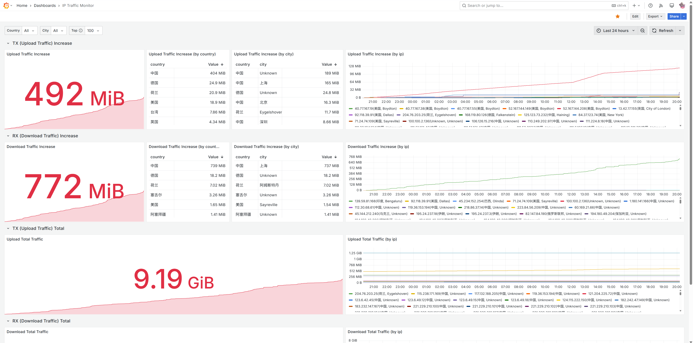

# ip_traffic_monitor_cli

基于 iftop/bpftrace 的精确 IP 流量统计工具，支持 **上行流量（TX）** 和 **下行流量（RX）** 双向监控，集成 Prometheus 和 IP 地理位置查询。

## 预览



*Grafana 仪表板展示了按国家、城市和 IP 统计的上行/下行流量，支持实时监控和历史趋势分析*

## 功能特性

- ✅ **双向流量监控**：同时统计上行（TX/上传）和下行（RX/下载）流量
- ✅ 支持 iftop 和 bpftrace 两种监控后端
- ✅ 内存存储 IP 流量累计数据
- ✅ Prometheus Exporter 接口（同时导出 TX/RX metrics）
- ✅ IP 地理位置信息（国家、省份、城市）
- ✅ ISP 运营商信息支持
- ✅ 支持永久运行模式
- ✅ 自动关联进程 PID
- ✅ 预制 Grafana 仪表板（`grafana/grafana.json`）

## 快速开始

### 基本使用（bpftrace 后端，推荐）

```bash
# 编译
cargo build --release

# 启动监控和 Prometheus exporter（无地理信息）
sudo ./target/release/ip_traffic_monitor_cli -b bpftrace -d 0 -p 9090
```

### 完整使用（含地理信息）

```bash
# 1. 下载 GeoIP 数据库（见下文）
# 2. 启动监控
sudo ./target/release/ip_traffic_monitor_cli \
  -b bpftrace \
  -d 0 \
  -p 9090 \
  -g GeoLite2-City.mmdb
```

### iftop 模式（需要指定网卡）

```bash
# 使用 iftop 后端（需要指定网卡名）
sudo ./target/release/ip_traffic_monitor_cli \
  -b iftop \
  -i eth0 \
  -d 0 \
  -p 9090
```

## Prometheus Exporter 使用

### 启动监控并启用 Prometheus exporter

```bash
# bpftrace 模式（推荐）- 启用 Prometheus exporter，监听在 9090 端口
sudo ./target/release/ip_traffic_monitor_cli -b bpftrace -d 0 -p 9090

# iftop 模式 - 需要指定网卡
sudo ./target/release/ip_traffic_monitor_cli -b iftop -i eth0 -d 0 -p 9090

# 启用地理位置查询
sudo ./target/release/ip_traffic_monitor_cli -b bpftrace -d 0 -p 9090 -g GeoLite2-City.mmdb
```

### 访问 metrics 端点

```bash
# 查看 Prometheus 格式的指标
curl http://localhost:9090/metrics
```

### Metrics 输出示例

#### 不使用 GeoIP 数据库

```
# HELP ip_traffic_tx_bytes_total Total transmitted bytes to remote IP address (egress/upload traffic)
# TYPE ip_traffic_tx_bytes_total counter
ip_traffic_tx_bytes_total{remote_ip="1.2.3.4",country="Unknown",province="Unknown",city="Unknown",isp="Unknown"} 1048576
ip_traffic_tx_bytes_total{remote_ip="5.6.7.8",country="Unknown",province="Unknown",city="Unknown",isp="Unknown"} 2097152

# HELP ip_traffic_rx_bytes_total Total received bytes from remote IP address (ingress/download traffic)
# TYPE ip_traffic_rx_bytes_total counter
ip_traffic_rx_bytes_total{remote_ip="1.2.3.4",country="Unknown",province="Unknown",city="Unknown",isp="Unknown"} 5242880
ip_traffic_rx_bytes_total{remote_ip="5.6.7.8",country="Unknown",province="Unknown",city="Unknown",isp="Unknown"} 10485760
```

#### 使用 GeoIP 数据库

```
# HELP ip_traffic_tx_bytes_total Total transmitted bytes to remote IP address (egress/upload traffic)
# TYPE ip_traffic_tx_bytes_total counter
ip_traffic_tx_bytes_total{remote_ip="8.8.8.8",country="美国",province="加利福尼亚州",city="芒廷维尤",isp="Unknown"} 2097152
ip_traffic_tx_bytes_total{remote_ip="114.114.114.114",country="中国",province="江苏省",city="南京市",isp="Unknown"} 3145728

# HELP ip_traffic_rx_bytes_total Total received bytes from remote IP address (ingress/download traffic)
# TYPE ip_traffic_rx_bytes_total counter
ip_traffic_rx_bytes_total{remote_ip="8.8.8.8",country="美国",province="加利福尼亚州",city="芒廷维尤",isp="Unknown"} 10485760
ip_traffic_rx_bytes_total{remote_ip="114.114.114.114",country="中国",province="江苏省",city="南京市",isp="Unknown"} 20971520
```

### Prometheus 配置

### Prometheus 查询示例

```promql
# 按国家统计上行流量
sum by (country) (ip_traffic_tx_bytes_total)

# 按国家统计下行流量
sum by (country) (ip_traffic_rx_bytes_total)

# 按省份统计总流量（上行+下行）
sum by (province) (ip_traffic_tx_bytes_total) + sum by (province) (ip_traffic_rx_bytes_total)

# 按运营商统计流量
sum by (isp) (ip_traffic_tx_bytes_total)

# 查看中国区域的流量
ip_traffic_tx_bytes_total{country="中国"}
ip_traffic_rx_bytes_total{country="中国"}

# 上行流量增长率
rate(ip_traffic_tx_bytes_total[5m])

# 下行流量增长率
rate(ip_traffic_rx_bytes_total[5m])

# Top 10 下载流量 IP
topk(10, ip_traffic_rx_bytes_total)

# Top 10 上传流量 IP
topk(10, ip_traffic_tx_bytes_total)
``` by (province) (ip_traffic_tx_bytes_total)

# 按运营商统计流量
sum by (isp) (ip_traffic_tx_bytes_total)

# 查看中国区域的流量
ip_traffic_tx_bytes_total{country="中国"}

# 流量增长率
rate(ip_traffic_tx_bytes_total[5m])
```

## GeoIP 数据库配置

### 下载 MaxMind GeoLite2 数据库（免费）

1. 注册 MaxMind 账号：https://www.maxmind.com/en/geolite2/signup
2. 下载 GeoLite2-City 数据库（MMDB 格式）
3. 解压得到 `GeoLite2-City.mmdb` 文件
## 命令行参数

```
-b, --backend <BACKEND>                监控后端: iftop 或 bpftrace [默认: iftop]
-i, --iface <IFACE>                    出口网卡名（iftop 模式必填）
-d, --duration <DURATION>              监控时长（秒，0=永久运行）[默认: 30]
-s, --sample-interval <SECONDS>        采样间隔 [默认: 2]
-p, --prometheus-port <PORT>           启用 Prometheus exporter 监听端口
-g, --geoip-db <PATH>                  GeoIP2 数据库文件路径（可选）
-t, --prometheus-export-threshold <N>  Prometheus 导出流量阈值（字节）[默认: 1048576]
    --bpftrace-script <PATH>           自定义 bpftrace 脚本路径（仅 bpftrace 模式）
## 使用场景

### 1. 实时流量监控

```bash
# 持续监控（内存模式，bpftrace 后端）
sudo ./target/release/ip_traffic_monitor_cli -b bpftrace -d 0

# 使用 iftop 后端
sudo ./target/release/ip_traffic_monitor_cli -b iftop -i eth0 -d 0
```

### 2. 定时监控

```bash
# 监控 5 分钟
sudo ./target/release/ip_traffic_monitor_cli -b bpftrace -d 300
```

### 3. Prometheus 集成

```bash
# 启动 exporter 供 Prometheus 抓取（推荐）
sudo ./target/release/ip_traffic_monitor_cli -b bpftrace -d 0 -p 9090 -g GeoLite2-City.mmdb

# 设置流量阈值，只导出大于 10MB 的 IP
sudo ./target/release/ip_traffic_monitor_cli -b bpftrace -d 0 -p 9090 -t 10485760
```

### 4. Grafana 可视化

#### 导入预制仪表板

项目提供了[完整的 Grafana 仪表板配置文件](./grafana/grafana.json)，可直接导入使用：

1. 在 Grafana 中添加 Prometheus 数据源
2. 导入仪表板：`Dashboards` -> `Import` -> 上传 `grafana/grafana.json`
3. 选择 Prometheus 数据源

仪表板包含以下面板：

**TX (上行流量) 相关:**
- Upload Traffic Increase（上行流量增量）- 总览
- Upload Traffic Increase (by country) - 按国家统计
- Upload Traffic Increase (by city) - 按城市统计
- Upload Traffic Increase (by ip) - 按 IP 统计（图表）
- Upload Total Traffic - 累计上行流量

**RX (下行流量) 相关:**
- Download Traffic Increase（下行流量增量）- 总览
- Download Traffic Increase (by country) - 按国家统计
- Download Traffic Increase (by city) - 按城市统计
- Download Traffic Increase (by ip) - 按 IP 统计（图表）
- Download Total Traffic - 累计下行流量

**可用变量:**
- `$country` - 过滤国家/地区
- `$city` - 过滤城市
- `$top_k` - Top K 数量（10/20/50/100/200/500/1000）

#### 手动创建仪表板

如需自定义，可使用以下 PromQL 查询：

```promql
# 按国家/地区上行流量分布
sum by (country) (ip_traffic_tx_bytes_total)

# 按国家/地区下行流量分布
sum by (country) (ip_traffic_rx_bytes_total)

# Top N 下载流量 IP
topk(10, ip_traffic_rx_bytes_total)

# Top N 上传流量 IP
topk(10, ip_traffic_tx_bytes_total)

# 上行流量趋势
rate(ip_traffic_tx_bytes_total[5m])

# 下行流量趋势
rate(ip_traffic_rx_bytes_total[5m])

# 时间段内流量增量（上行）
ip_traffic_tx_bytes_total - (ip_traffic_tx_bytes_total @ ${__from:date:seconds})

# 时间段内流量增量（下行）
ip_traffic_rx_bytes_total - (ip_traffic_rx_bytes_total @ ${__from:date:seconds})
```
# 启动 exporter 供 Prometheus 抓取（推荐）
sudo ./target/release/ip_traffic_monitor_cli -i eth0 -d 0 -p 9090 -g GeoLite2-City.mmdb

# 设置流量阈值，只导出大于 10MB 的 IP
sudo ./target/release/ip_traffic_monitor_cli -i eth0 -d 0 -p 9090 -t 10485760
```

### 4. Grafana 可视化
## TODO

- [x] 统计上行流量（TX）
- [x] 统计下行流量（RX）
- [x] 接入 prometheus
- [x] IP 地理位置查询
- [ ] 使用 systemd 管理进程

## 依赖

- iftop（可选）: 流量监控工具（内存占用约 7MB）
- bpftrace（可选，推荐）: 高级流量追踪，统计数据更准确（内存占用约 50 MB）
- GeoIP2 数据库（可选）: IP -> 地理位置查询（使用 mmap + 结果缓存，内存占用为几 MB）

## 流量方向说明

- **上行流量 (TX/Transmit/Upload/Egress)**: 从本机发送到远程 IP 的流量
- **下行流量 (RX/Receive/Download/Ingress)**: 从远程 IP 接收到本机的流量

详细说明请参考：[docs/20251230_TRAFFIC_DIRECTION.md](docs/20251230_TRAFFIC_DIRECTION.md)
- [ ] 支持 GeoIP2-ISP 数据库
- [ ] 支持纯真 IP 数据库

## 依赖

- iftop（可选）: 流量监控工具（内存占用约 7MB）
- bpftrace（可选）: 高级流量追踪，统计数据更准确（内存占用约 50 MB）
- GeoIP2 数据库（可选）: IP -> 地理位置查询（使用 mmap + 结果缓存，内存占用为几 MB）

## 架构说明

本工具采用内存存储架构：
- 所有 IP 流量数据存储在内存中的 HashMap
- 累计每个 IP 的总字节数
- 通过 Prometheus exporter 直接导出实时数据
- 适合与 Prometheus + Grafana 配合使用进行长期存储和可视化

## 许可证

MIT